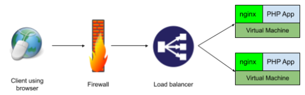
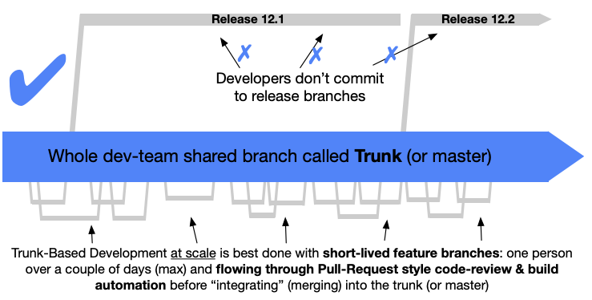

# Part A

1. _Tell us about your main motivation to pursue a career in the software industry!_

   My main motivation to pursue a career in the software industry is driving by the reality now that people cannot separated with digital lifestyle. We know that digital lifestyle is inside all of our daily life, such as transportation, food, shopping, till one of the biggest decission in life, like buying home. So when all the activity moved to digital, we need solution to make this new lifestyle have good experience. Digital industry cannot be separated with software industry. So I want to involve in the process of digitalization on the all of lifestyle and make the experience of the product from this industry more better.

2. _Tell us about your strength that help your profession as a software engineer and how do you take advantage of them to become a better engineer!_

   My strength as a software engineer is curiousity, want to know everything as a whole big system, about technology that already used (also the alternative), and how things works. I also self proclaim that I am generalist, thats mean I will do everything as long as I can, specifically when doing my job as software engineer. When I know how all the small things works, I will also know how all whole big system works and hopefully can help me to troubleshoot when bad things happens, how to avoid them, and create better system.

3. _Tell us about yout weaknesses that give you challenges and what are your efforts to overcome them!_

   My biggest weakness is I can only focus at one job, one task at a time. I can't do parallel job because it makes overwhelming and too much information in my head. So to tackle this, I will create prioritization about what task should be done first before anything else. I also can't do my task when in crowded and noisy place. So I will moved to place with little noise or using earphone when I do my task.

4. _Tell us about the most challenging project that you have worked on and what efforts or strategies did you use to solve the problems you met in that project!_

   The most challenging project that I have worked on is when migrating all cloud infrastructure from AWS to GCP. Because at that time I have no experience in GCP, firstly I have to learn the subtitution about what service that AWS provide and GCP provide. After that, I create spreadsheet that contains all of services that currently used in AWS and what the subtitution on GCP, and assign the migration tasks to the team. The migrations of all the service is conducted one by one, and the services and workloads will be running in parallel, both in AWS and GCP. After all the service is moved, we changed the DNS endpoint to the GCP and all workloads moved to new infrastructure in GCP.

5. _Tell us about external factors that you would consider ideal to help you become a more effective engineer!_

   I believe that having a role model in software industry with a lot of experience in solving various problem is one of external factors that helps me become a more effective engineer, because I can learn from his experience, either bad or good experience. So when I faced the same condition I have the solution from it. Having good community support in software industry is also a good external factor because we can share our experience with each other and we can also get feedback about it.

6) _Tell us about how you see yourself in the next five years in software industry!_

   In the next five years, I see myself have already known all the things that should exists in whole big software systems, including frontend, backend, infrastructure/DevOps thing, and also on the data side (data engineering, BI, AI) so I can give end-to-end solution to whom needed to solve the digitalization process. Beside that, we all know that technology development move so fast. So I will keep learning new things to keep updated about how to solve problem with the best tools and knowledge.

# Part B

1. _When setting up a new website, the web can’t be accessed. On nginx error log it returns_
   `/var/www/html/index.html is forbidden (13: Permission denied).`

   _Doing an `ls -la` on `/var/www/html` returns the following result:_

   ```
   /var/www/html$ ls -al
   total 12
   drwxr-xr-x 2 root root 4096 Jul 8 09:47 .
   drwxr-xr-x 3 root root 4096 Mei 29 11:27 ..
   ---------- 1 root root 612 Mei 29 11:27 index.html
   ```

   _Explain how would you solve this issue as detailed as you need it to be. Feel free to add assumption as needed._

   **Answer**

   These problem appeared because permission of `index.html` file that should be accessed by nginx is sufficient. The permission of `index.html` file is 000, that means no read, write, execute access from all of user and group. To solve this problem, as minimum, read access permission from all user (assuming nginx use `nginx` user to spawn process) should be applied to `index.html`. So we need to use `chmod` command to change the permission:

   ```
   # assuming working directory is in /var/www/html
   chmod 444 index.html
   ```

   But for convinience, we should probably add `user` write permission to the file for editing purpose. So final command is

   ```
   chmod 644 index.html
   ```

   The website should be accessible again.

---

2. _There’s a production database on server A that can only be accessed from server B. A database engineer needs to access the database regularly on server A but only has the permission to connect to server B. Explain how would you set the environment for the database engineer to connect to server A. You can be as detailed as possible and use assumption for the information that’s not given here._

   **Answer**

   Assuming `Server A` and `Server B` lived in public cloud and inside custom VPC, both server using CentOS as OS, and production database inside `Server A` is MySQL. `Server A` firewall's configured to only be accessed by `Server B` at port `3306`. `Server B` can also be accessible via public network and listen to default ssh port.
   Each of server has configured IP Address as is:

   - Server A :
     - Private Address: `192.168.1.2`
   - Server B :
     - Private Address: `192.168.1.3`
     - Public Address: `5.4.3.2`

   The main idea of the environment need to be prepared for database engineer to access to production database in daily bases is by **SSH tunneling**. We use `Server B` as a jumpbox/bastion to access production database. Task that should be done in order:

   **In `Server B`**

   1. Create new user for accessing the server (we can use database engineer's username, let's say user `foo`)
      ```
      adduser foo
      ```
   2. Create SSH keygen for user `foo`

      ```
      # Change to user `foo`
      su - foo

      # Generate ssh keygen
      ssh-keygen

      # Get the key
      cat ~/.ssh/id_rsa
      ```

   3. Save the key to the file (let's say `foo.key` file) and send it to the database engineer

   **In database engineer's workstation:**

   Assuming database engineer using Linux based workstation/laptop

   1. Place the key inside safe place (let's say `/home/.ssh/foo.key`)

   2. Depending on how database engineer connect to production database, it can be using database manager tool like TablePlus or Navicat, or via shell.

      If database engineer's accessing database using shell, firstly he/she should initiate SSH tunneling connection to the `Server B` using following command:

      ```
      ssh -L 3306:192.168.1.2:3306 -i /home/.ssh/foo.key foo@5.4.3.2
      ```

      Description:

      - Option `-L 3306:192.168.1.2:3306` means that we will tunnel port 3306 on localhost to port 3306 at 192.168.1.2 (`Server A` private address).
      - Option `-i /home/.ssh/foo.key` means that we will use key to connect to `Server B` SSH connection.

      after that, then we can use another terminal session to access the database with `localhost` as database host address and `3306` as database port.

      Otherwise, if database engineer's accessing database using database management tool like TablePlus, Navicat, etc then we can create new connection with ssh tunneling option enabled, and fill the parameter as follows (this parameters based on TablePlus, should be same in another database management tools):

      | Params          | Value                | Description                                       |
      | --------------- | -------------------- | ------------------------------------------------- |
      | Host            | `192.168.1.2`        | Private address of database server/`Server A`     |
      | Port            | `3306`               | Database server port                              |
      | Over SSH        | `checked`            | Check to activate SSH Tunneling                   |
      | Server          | `5.4.3.2`            | Public address of jumpbox/bastion `Server B`      |
      | Port            | `22`                 | SSH Port of jumpbox/bastion                       |
      | User            | `foo`                | SSH Username                                      |
      | Use SSH Key     | `checked`            | Check to use keyfile as ssh authentication method |
      | SSH Private Key | `/home/.ssh/foo.key` | Path to SSH private key                           |

---

3. _Assume we have setup a service with the following layers:_

   

   _When the client receive error 502 Bad Gateway, how would you like to troubleshoot to fix the issue to point out the root problem? You can be as detailed as possible and use assumption for the information that’s not given here._

   **Answer**

   When error 502 Bad Gateway happens, most likely the problem is the upstream application behind load balancer/reverse proxy cannot be accessed. So we need to take a deeper look what causing this problem.

   Top to Bottom approach:

   - First Layer: Client to Firewall

     There is no error that causing bad gateway error between client to firewall connection, because firewall just only enforce security policy, for example port that should be accessable publicly.

   - Second Layer: Firewall to Load Balancer

     In this layer also no error that causing bad gateway error because the correlation between firewall and load balancer is firewall only enforce security policy, not causing upstream app not accessible.

   - Third Layer: Load Balancer to Virtual Machine

     In this layer, probably there is problem that causing bad gateway error, such as network connection between load balancer and VM. In the diagram, there is 2 VM serving same app, connected to single Load Balancer. If both connection was down, or both VM was also down, or there is problem with web app inside VM, most likely will make client receive 502 bad gateway error. If there is no problem with connection or VM, then we should check to next layer.

   - Fourth Layer: Nginx to PHP App (inside VM)

     In this layer, inside the VM, there are 2 service that mainly serve traffic from client, nginx as reverse proxy and PHP App as upstream/backend app. Likely the cause of error is misconfigured nginx (different listening port, wrong upstream port, etc.) or probably PHP App is throwing error that caused by the code itself (wrong syntax, misspelled code, etc.). We need to look at log both nginx and php app, so we will know what error that causing bad gateway.

---

# Part C

This part helps us to understand how you would design and build a scalable system that could serve million users per month. Choose minimum 1 problem that you find the most interesting.

Tell us how you would design the system given the requirements, what technologies (open source or 3rd party) you are going to use, and the strategy/approach that you are going to use to handle high usage. You can use diagrams to help illustrate your explanation. Feel free to add assumptions.

1. _Let’s imagine we are going to build a Restful API system that can be accessed securely from public, fast enough to respond with sufficient body size, and minimum down time (nearly 0%). The system also will use common relational database (such as MySQL, PostgreSQL). With those conditions, tell us how would you design the system and the technologies that are used, preferably as cost-efficient as possible. Explain the strengths and weaknesses of that design._

   **Answer**

   **Outline**

---

2. _Let’s imagine we are going to build a web application. There will be several people working on the code, and we need the code to be documented for every change. We need a system with at least two environments (production and other environment(s)) that can support our fast-paced product-delivery every two weeks. Sometimes, when a bug is found, the fix needs to be implemented on the web application as soon as possible. With those conditions, what do you think is the best solution to be implemented and what technologies will you use?_

   **Answer**

   There are 3 problems that need to be solved in this scenario:

   - How we make sure that several people can working on the code in parallel without problems, and all code change should be documented
   - How we create multiple environments that can support delivery of the web product
   - How to apply patch fix immediately when bug is found in production

   In general, I would like to propose **Git** as version control system. Git will keep our codebase and people that working on the code will commit their work to it, so that means every change on the codebase will be documented.

   To make this collaboration happens, we need Git server. So I proposed to use **Gitlab** as git repository server. Gitlab has a bunch of features that will help us develop and deliver the app to production. Some of the feature that will be use:

   - Git repository
   - Issue Tracker
   - Merge Request
   - Gitlab CI and Gitlab Runner (for CI/CD purposes)

   When it comes to the branching model, I proposed to use **Trunk Based Development** with _short lived feature branch_. Here is the diagram of Trunk Based Development with short lived feature branch

   

   _Image taken from: [trunkbaseddevelopment.com](https://trunkbaseddevelopment.com)_

   Trunk based development is a source-control branching model, where developers collaborate on code in a single branch called 'trunk' or on Git we called it 'master', resist any pressure to create other long-lived development branches by employing documented techniques. They therefore avoid merge hell, and do not break the build. When it comes at scale, trunk based development is best done with short lived feature branch, that means each person of development team working on code, has a 'feature' branch that will be lived over a couple of days (max), and will be merge through pull-request style code-review & build automation before merging into the trunk (master) branch. Usually 'feature' branch will follow the issue tracker number, so 1 issue/feature will be done in 1 feature branch with maximum development time of certain days only. When feature is ready to be released, we promote it using git tag with version number on the master branch that refer to certain commit.

   To make product delivery at fast pace, we need system to automatically deliver new feature. So I proposed to use Continuous Integration & Continuous Deployment with one of Gitlab feature: Gitlab CI and Gitlab Runner. Gitlab CI is a part of Gitlab feature that helps us create integration & deployment pipeline of the code specially for code that hosted in Gitlab. We can define pipeline job, somehow like `build` job, `test` job, and `deploy` job on `gitlab-ci.yml` file inside code repository. To make this job run, we need job runner, that Gitlab Runner come to the rescue. It can run job inside VM, container, etc. We can also define what will trigger the pipeline. It can be push the certain branch, or certain tags, with certain prefix, etc.

   Next part is the environment of code development and deployment. I proposed to have 3 different environment:

   - Development Environment

     This environment insist in every team member's workstation for developing purposes. It can be docker compose with service needed to run the web application.

   - Staging Environment

     This environment should be created for staging purposes. When team member develop new feature in 'feature' branch, and merged to trunk, it will be triggering CI pipeline to deploy the code to this environment. This environment should be same as Production environment, so when any bug or error happens in production, can be reproduced in staging environment.

   - Production Environment

     This environment will be the place of production workloads of the web application. When commit in trunk/master branch already deployed in staging environment and automated test conducted in CI job not showing any error, we can tag it as new 'release' with git tag (with certain format like `release-${version_number}`) and it will trigger CI pipeline to deploy the code to production environment.

   When bug or error happens in production, we should apply patch fix immediately. Team that assigned to solve the problem can checkout to commit on trunk/master where error happens in production, reproduce the error on staging environment, then create a temporary 'feature' branch to solve the error, then merge back to trunk and give it a git tag with certain format to trigger path to production environment immediately. So this approach will take little time to be done.

---

3. _Let’s imagine we already have a Web app that runs on production. The app is behind a load balancer, running on virtual machines/containers and use a single database for transaction data. To reduce operational cost, we want to move the system into cloud public infrastructure such as AWS or GCP. Describe the migration steps that we should do with minimum down time._

   **Answer**

   **Outline**

   - Assume current condition + diagram
   - define new system in cloud
   - migration step
     - provision new infra in cloud
     - deploy codebase to new cloud
     - sync database to new infra
     - change codebase to split read and write data to database
     - first, old database are read write, but new database are read only.
     - test all app functionality
     - then after all test conducted and no problem, change config to read and write data to new database and switch dns endpoint to new loadbalancer
